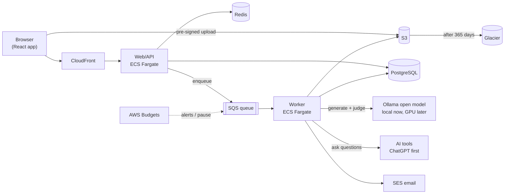
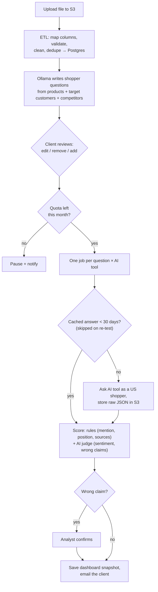
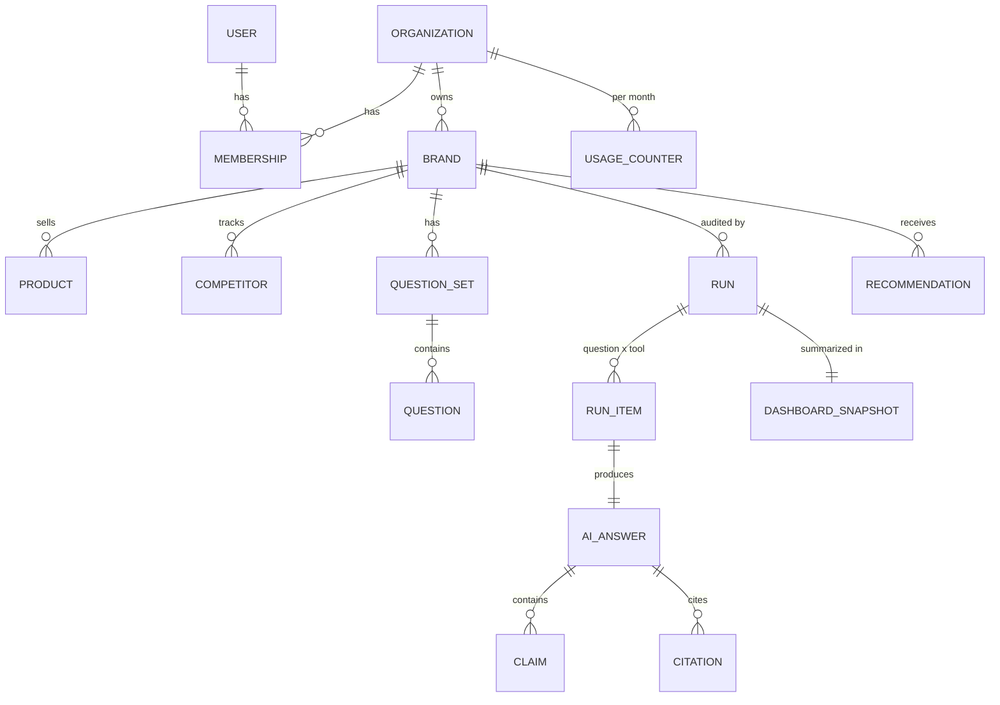

# Nexo platform: architecture plan

> **Status:** planning draft (2026-09-30) for the **real product**. The `/demo` page is a
> front-end mock of the same flow with simulated data. Screens: [WIREFRAMES.md](WIREFRAMES.md).

## 1. The product in one paragraph
A US brand (small, medium or large) uploads its product data. Nexo cleans it (ETL), uses an
open model to write realistic shopper questions, lets the brand review them, asks AI tools
those questions, and scores every answer: **is the brand mentioned, where, and is what the AI
says actually true?** An analyst confirms wrong claims, a consultant recommends fixes, the brand
approves and makes them, and Nexo **re-tests to prove the fix worked**.

**What makes it different:** accuracy checking against verified product data, root cause down
to the exact product field, human-approved fixes with a proven re-test, and questions generated
from the brand's own products by a model we run ourselves. Most AI-visibility tools only count mentions.

## 2. Decisions
| Topic | Decision |
|---|---|
| Architecture | **Modular monolith**: one Node.js codebase, deployed as a **web/API service** and a **worker** (same code, different start command) |
| Cloud | **AWS**: ECS Fargate, SQS (+ dead-letter queue), RDS **PostgreSQL**, ElastiCache Redis, CloudFront, SES, Secrets Manager, CloudWatch |
| Files | **S3** (uploads, raw AI answers, reports) → **Glacier after 1 year**; nothing is deleted |
| Cache | AI answers reused for **30 days**; **re-tests always skip the cache**; dashboards read precomputed snapshots |
| Question model | Open model on **Ollama**: local computer now, AWS GPU server later |
| Login | Built in-house: email + password, verification, reset, **2FA** (required for Nexo staff) |
| Accounts | One organization per company, many users, several brands |
| Market | **US only** (every question is asked as a US shopper) |

**Launch defaults (can change):** ChatGPT (OpenAI API with web search) only, with other tools
added through the same provider interface; one "question" = one prompt to one AI tool; manual
invoicing (Stripe later); built-in consultation booking; SSO later for large plans.

**Why a monolith:** one technical person, so one repo, one deploy and one database. Slow work
(ETL, Ollama, hundreds of AI calls) runs in the **worker** from a **queue**, never inside a web
request. The first module to split out later is the model runner (it needs a GPU).

**Modules:** `accounts` · `catalog` (brands, products, competitors) · `etl` · `questions` ·
`providers` (one adapter per AI tool) · `runs` (jobs, cache, quotas) · `scoring` · `insights`
(dashboards, exports) · `optimize` (fixes, audit log) · `consult` · `notify` · `billing`.

## 3. System diagram

The Ollama computer runs a small local worker that **pulls** jobs from SQS, so no ports are
opened on it. Moving to a GPU server later means running the same worker there.

## 4. One audit run

**Run states:** draft → questions ready → in review → queued → running → scoring → analyst
review → complete (plus paused for quota, failed → retry).

## 5. Data intake (ETL)
- **Formats:** CSV, TSV, Parquet, Excel, JSON/JSONL (later: Google Merchant and Shopify feeds).
- Browser uploads **straight to S3** (pre-signed URL); the original is kept forever.
- **Column mapping** screen, saved for next time. **Required:** `name` + (`product_url` or
  `short_description`). **Optional:** sku, category, price, target_customer,
  important_features, any extra attributes.
- **Validation report:** rows imported, skipped (with reason), duplicates merged.

## 6. Scoring
| What | How |
|---|---|
| Mentioned? Position? Which competitors? | Rules: name + alias matching |
| Sources the AI cited | Parsed from the provider's response |
| Sentiment | AI judge (the open model) |
| Wrong claims (price, features, availability, policies) | AI judge compares each claim with the product data, then an **analyst confirms** before the client sees it |

## 7. Storage and caching
- **Postgres:** everything the app queries (accounts, products, questions, runs, scores, snapshots, fixes, audit log).
- **S3:** `uploads/`, `answers/`, `reports/`; encrypted, versioned, private; Glacier after 365 days.
- **Three cache layers:** (1) AI answers reused for 30 days (key = tool + model version +
  question + "US"); (2) dashboard **snapshot** computed once per run; (3) Redis/CloudFront for
  hot reads, cleared when a new run finishes.
- **Dashboards never read from Glacier** (slow and costly to retrieve).

## 8. Database (core tables)

Also: `sessions`, `product_imports`, `mentions`, `recommendation_events`, `consultations`,
`availability_slots`, `audit_log`.

## 9. Roles and login
| Client roles | Nexo roles |
|---|---|
| **Owner**: users, plan, billing, approve fixes | **Analyst**: confirm wrong claims, run re-tests |
| **Member**: upload, review questions, start runs, approve fixes | **Consultant**: write fixes, run consultations |
| **Viewer**: read-only | **Admin**: plans, quotas, budget overrides |

Login: argon2 password hashing, httpOnly session cookies, rate limiting + lockout, email invites.
Every organization only sees its own data.

## 10. Plans, budget and triggers
| Plan | Questions / mo | Products | Competitors | Users | Max file | Est. API cost / mo |
|---|---|---|---|---|---|---|
| Small | 200 | 100 | 5 | 3 | 25 MB | $6 |
| Mid | 600 | 1,000 | 10 | 10 | 100 MB | $18 |
| Large | 1,200 | 20,000 | 20 | Unlimited | 500 MB | $36 |

Projected OpenAI spend: **2027** $1,755/yr (25 clients by year end) · **2028** $5,697 (60) ·
**2029** $13,860 (120). *Based on a $0.03/question planning rate (web search included), to be
confirmed against OpenAI's published pricing before launch. Even at 3× that rate, API cost stays
small next to analyst and consultant time.*

**Triggers:** per-client quota → email at **80%**, runs pause at **100%** until an admin approves
or the month resets. Company-wide **AWS Budgets** alerts at **50 / 80 / 100%**, with an optional
emergency pause of the queue.

## 11. Re-tests and human-approved fixes
- Re-tests run **monthly**, from a **"re-test now"** button, or **after approved fixes** (only the
  affected questions). They reuse the same question version, skip the cache and show **before vs after**.
- Fix flow: analyst confirms wrong claim → consultant writes a fix (evidence, before/after,
  priority) → client approves → client changes **their own** site or feed → marks done → re-test →
  result attached. Every step goes in the audit log. Nexo never edits client sites.

## 12. Risks and mitigations
| Risk | Mitigation |
|---|---|
| **API answers can differ from the consumer ChatGPT app** (memory, personalization, shopping features) | Use search-enabled API models set to a US location; label results "API-measured"; analysts spot-check a sample in the real apps each month and track the gap |
| **AI answers vary from one ask to the next** | Ask each question several times and report a **mention rate** (e.g. 3 of 5) instead of a single yes/no; flag big swings as low confidence |
| **API pricing not confirmed** ($0.03/question) | Confirm before launch; quotas and AWS Budgets cap spend; the 30-day cache and "re-test only affected questions" reduce calls |
| **Not every AI tool has a public API** (e.g. Copilot) | Launch with ChatGPT; add tools as APIs allow; otherwise manual analyst checks |
| **Provider terms, rate limits, outages** | Official APIs only (no scraping), retries with backoff, dead-letter queue, per-provider rate limits |
| **Wrong-claim false positives** | AI judge + mandatory analyst confirmation before clients see a claim |
| **Local model computer is a single point of failure** | Jobs wait safely in SQS; move the same worker to an AWS GPU server (or a hosted open model) when volume grows |
| **Client data privacy** | Product data stays in our AWS account and our own model; only the questions go to AI tools; encryption everywhere; strict per-organization access |
| **Small team, big scope** | Modular monolith, managed AWS services, and the phased plan below; hire a second engineer before phase 5 |

## 13. Build phases
1. **Foundation:** AWS setup, Postgres, login, organizations, roles
2. **Intake:** S3 uploads, ETL, column mapping, competitors
3. **Questions:** local Ollama worker, generation, review/edit, versions
4. **Runs:** queue, OpenAI provider, 30-day cache, quotas, budget alerts
5. **Scoring + dashboard:** rules + AI judge, analyst queue, snapshots, exports
6. **Optimize + consult:** fixes, approvals, audit log, re-tests, booking
7. **Scale:** more AI tools, GPU server, Stripe, SSO, product feed integrations
