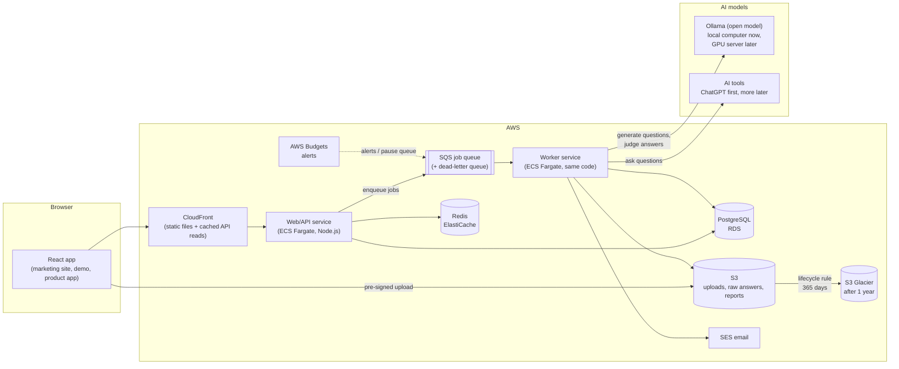
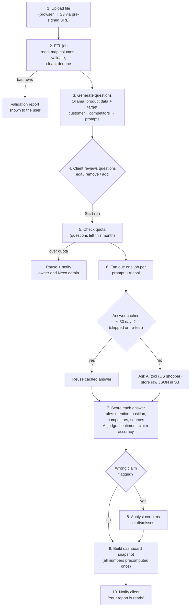
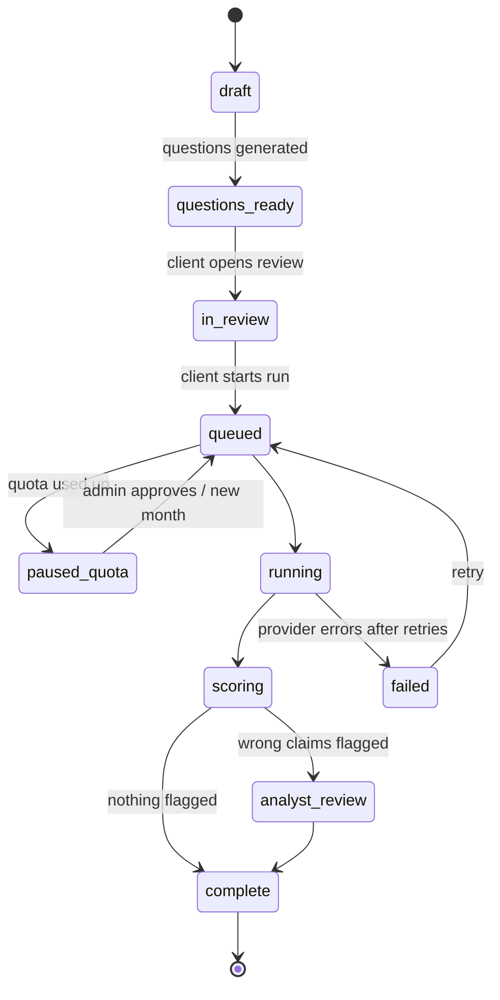
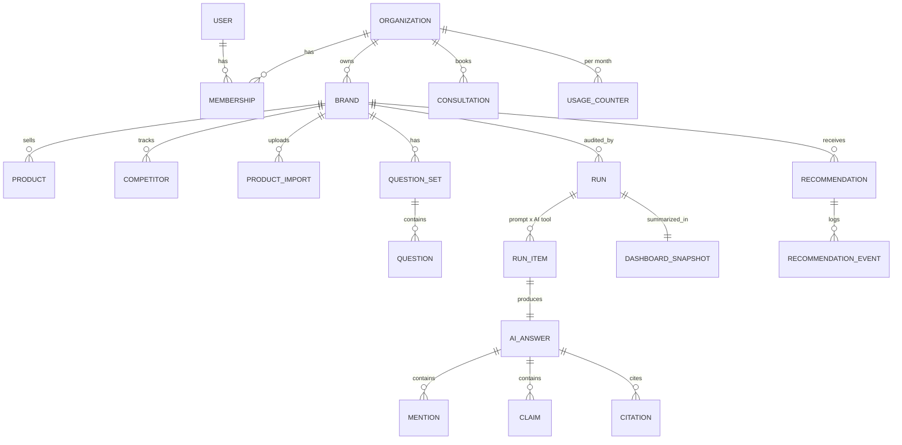
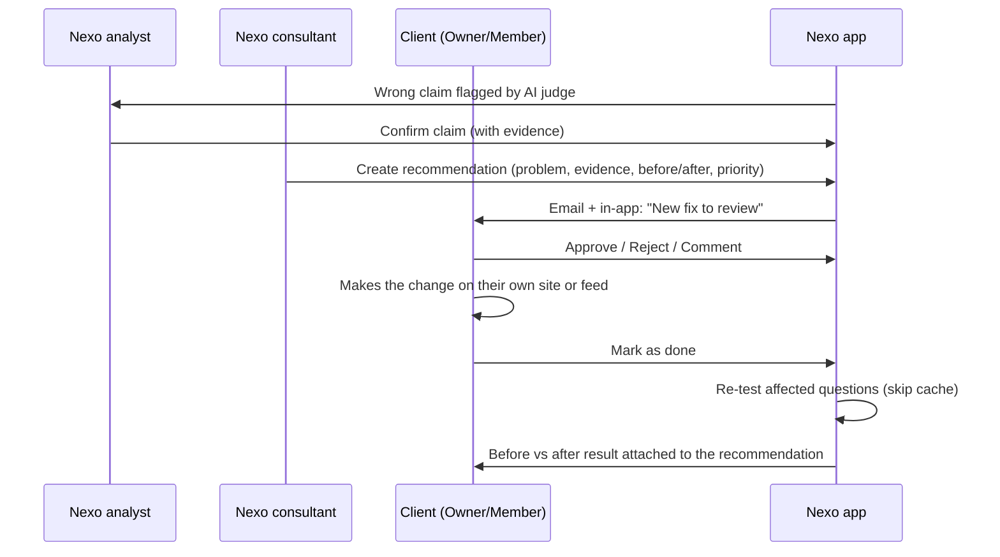

# Nexo platform: architecture plan

> **Status:** planning draft (2026-09-30). This describes the **real product**, not the hackathon
> demo. The demo at `/demo` is a front-end mock of the same flow with simulated data.
> Screen layouts are in [WIREFRAMES.md](WIREFRAMES.md).

## 1. What the product does

Nexo helps small, medium and large **US brands** find out how AI assistants talk about their
products, and fix what is missing or wrong.

1. A brand signs up and uploads its product data (CSV, Parquet, Excel, JSON).
2. An **ETL job** cleans the data and an **open AI model** (Ollama) turns it into realistic
   shopper questions ("synthetic data").
3. The brand **reviews the questions** (edit, remove, add).
4. Nexo sends the questions to **AI tools** (ChatGPT first, more later) and stores every answer.
5. Answers are **scored** (mentioned? position? sentiment? wrong claims? which sources?).
6. A **dashboard** shows the results; a Nexo **analyst** confirms wrong claims and a
   **consultant** recommends fixes.
7. The brand **approves** fixes, makes them, and Nexo **re-tests** to prove they worked.

## 2. Decisions

| Topic | Decision |
|---|---|
| Architecture | **Modular monolith**: one codebase, one database, deployed as a **web/API service** and a **worker service** (same code, different start command) |
| Cloud | **AWS** for everything (the marketing site can stay on Vercel until the move) |
| Database | **PostgreSQL** (Amazon RDS) |
| File storage | **Amazon S3**, moved to **S3 Glacier** after 1 year by a lifecycle rule. **Nothing is deleted.** |
| Cache | Redis (Amazon ElastiCache) + precomputed dashboard snapshots in Postgres + CloudFront |
| AI answer cache window | **30 days** (a re-test always skips the cache) |
| Question generation | Open model on **Ollama**, on a local computer for now; move to an AWS GPU server later |
| Login | **Built in-house**: email + password, email verification, password reset, optional 2FA (required for Nexo staff) |
| Accounts | One **organization** per company, **many users** per organization, several brands allowed |
| Market | **US brands only** (all AI questions are asked as a US shopper) |
| Emails | Amazon SES |
| Budget control | Per-client monthly quotas in the app + AWS Budgets alerts |

**Assumptions (my defaults, change freely):**
- **Launch with ChatGPT (OpenAI API, web search on) only.** The budget below is priced for
  OpenAI. Gemini, Claude, Perplexity and Copilot are added later through the same
  "AI provider" interface. (Copilot has no general public API today; it may stay manual.)
- **One "question" = one prompt sent to one AI tool.** With several tools, a prompt counts once per tool.
- **Billing** is invoiced by hand at first; Stripe subscriptions come in a later phase.
- **Consultation booking** is built in: analysts set availability, clients pick times (like the demo).
- **Single sign-on** (SSO) for large companies is a later phase.

## 3. Why a modular monolith (and not microservices)

- One technical person: one repo, one deploy pipeline, one database is far easier to run and debug.
- Clear **modules** inside the codebase keep it organized and let us split one out later.
- The slow work (ETL, Ollama, hundreds of AI calls) must **not** run inside web requests
  (they would time out and users would wait). It runs in the **worker**, fed by a **queue**.
- **First candidate to split out later:** the model runner (Ollama), because it needs a GPU
  and scales differently.

**Modules:**

| Module | Owns |
|---|---|
| `accounts` | organizations, users, roles, sessions, invites, 2FA |
| `catalog` | brands, products, competitors, file imports, column mappings |
| `etl` | reading files (CSV, TSV, Parquet, XLSX, JSON/JSONL), validation, cleaning, dedupe |
| `questions` | question generation (Ollama), question sets, review/edit |
| `providers` | one adapter per AI tool (OpenAI first), rate limits, retries |
| `runs` | run lifecycle, fan-out of prompt × tool jobs, answer cache, quotas |
| `scoring` | mention/position rules, AI judge (sentiment, claim accuracy), citations |
| `insights` | dashboard snapshots, run comparison, exports (PDF/CSV) |
| `optimize` | recommendations, client approvals, audit log |
| `consult` | analyst availability, consultation requests |
| `notify` | emails (SES), in-app notifications |
| `billing` | plans, usage counters, invoices (manual at first) |

## 4. System diagram

**Local model for now:** the Ollama computer runs a small **local worker** that *pulls*
generation and judging jobs from SQS and writes results back. No inbound ports need to be
opened on that computer. Moving to a GPU server later means running the same worker there.

## 5. Data pipeline (one audit run)

**Run states:** `draft → questions_ready → in_review → queued → running → scoring →
analyst_review → complete` (plus `paused_quota` and `failed`).

## 6. Data intake (ETL)

- **Formats:** CSV, TSV, Parquet, Excel (.xlsx), JSON, JSONL. Later: Google Merchant and
  Shopify product feed exports.
- **Upload:** the browser uploads straight to S3 with a pre-signed URL (big files never pass
  through the web server). The original file is kept in S3 forever (Glacier after a year).
- **Column mapping:** the user matches their columns to ours ("Product Title" → `name`).
  Mappings are saved and reused for the next upload.

| Field | Required? |
|---|---|
| `name` | **Required** |
| `product_url` **or** `short_description` | **At least one required** |
| `sku`, `category` / industry, `price`, `target_customer`, `important_features`, any extra attributes (e.g. `waterproof`) | Optional |

- **Validation report:** rows imported, rows skipped (with the reason), duplicates merged.
- **Limits by plan:**

| Plan | Max file size | Max products | Competitors | Users | Questions / month |
|---|---|---|---|---|---|
| Small | 25 MB | 100 | 5 | 3 | 200 |
| Mid | 100 MB | 1,000 | 10 | 10 | 600 |
| Large | 500 MB | 20,000 | 20 | Unlimited | 1,200 |

## 7. Questions (synthetic data)

- Ollama builds prompts from each product's description, target customer, features, price,
  category and the competitor list, in several types: category, feature, comparison, fact
  check, budget, scenario, brand.
- The client **reviews the question set**: edit wording, remove, add their own, and see how
  many questions the run will use against the monthly allowance.
- Question sets are **versioned**, so a re-test can use exactly the same questions.

## 8. Scoring

| What | How |
|---|---|
| Brand / product mentioned, position in the answer, competitors mentioned | **Rules**: name + alias matching (e.g. "Stormline Trail", "Niek Stormline") |
| Sources / citations the AI used | **Rules**: parsed from the provider's response |
| Sentiment of each mention | **AI judge** (the open model) |
| Wrong claims (price, features, availability, policies) | **AI judge** compares the claim with the brand's product data, then an **analyst confirms** before the client sees it |

## 9. Storage and caching

**Postgres** holds everything the app queries. **S3** holds files and raw AI answers.

| S3 bucket (prefix) | Contents | Lifecycle |
|---|---|---|
| `uploads/` | original product files | Standard → **Glacier after 365 days**, never deleted |
| `answers/` | raw AI responses (JSON) | Standard → **Glacier after 365 days**, never deleted |
| `reports/` | exported PDF/CSV reports | Standard → **Glacier after 365 days**, never deleted |

All buckets: encryption on, versioning on, public access blocked.

**Caching (so we do fewer reads and fewer paid API calls):**

1. **AI answer cache (30 days):** key = hash of (AI tool + model version + exact question +
   "US"). A cached answer younger than 30 days is reused instead of calling the API again.
   **Re-tests always skip this cache** (they must see fresh answers after a fix).
2. **Dashboard snapshots:** when a run finishes, the worker computes every dashboard number
   once and saves one summary per run. Opening a dashboard reads that summary, not thousands of answers.
3. **Redis + CloudFront:** hot dashboard responses and sessions are cached; the cache is
   cleared when a new run completes.

**Rule:** dashboards never read from Glacier. Glacier is only the long-term archive (it is
slow and costs money to retrieve).

## 10. Database (core tables)

| Table | Key columns |
|---|---|
| `organizations` | name, plan (small/mid/large), status |
| `users` | email, password_hash (argon2), email_verified_at, totp_secret |
| `memberships` | user, organization, role |
| `sessions` | user, token hash, expires_at, ip, user agent |
| `brands` | organization, name, website, location, industry |
| `products` | brand, sku, name, category, price, product_url, short_description, target_customer, important_features, extra (JSON) |
| `product_imports` | brand, s3_key, format, column_mapping, rows_ok, rows_skipped, report |
| `competitors` | brand, name, website, aliases |
| `question_sets` / `questions` | version, text, type, persona, product, status (active/removed), source (generated/client) |
| `runs` | brand, question_set, tools, is_retest, status, started/finished |
| `run_items` | run, question, tool, status, cache_hit |
| `ai_answers` | tool, model version, question hash, s3_key, cached_until |
| `mentions` / `claims` / `citations` | answer, brand, position, sentiment / claim text, verdict, analyst status / url, domain |
| `dashboard_snapshots` | run, all precomputed metrics (JSON) |
| `recommendations` / `recommendation_events` | problem, evidence, before/after, priority, status / who did what, when |
| `consultations`, `availability_slots` | requested slots, format, analyst, consultant, status |
| `usage_counters` | organization, month, questions_used, questions_allowed |
| `audit_log` | actor, action, target, time (every approval and admin action) |

## 11. Accounts and roles

| Role | Side | Can |
|---|---|---|
| **Owner** | Client | everything for their organization: users, plan, billing, approve fixes |
| **Member** | Client | upload data, review questions, start runs (within quota), approve fixes |
| **Viewer** | Client | read dashboards and reports |
| **Analyst** | Nexo | confirm/dismiss flagged claims, run re-tests, see all assigned clients |
| **Consultant** | Nexo | write recommendations, manage consultations |
| **Admin** | Nexo | plans, quotas, budget overrides, user support |

**Login (built in-house):** email + password (argon2 hashing), email verification, password
reset by emailed one-time link, session cookies (httpOnly, secure), login rate limiting and
lockout after repeated failures, **2FA (authenticator app)** optional for clients and
**required for Nexo staff**. Invites by email for new team members. SSO later for Large plans.

## 12. Budget and cost control

**OpenAI API budget (planning numbers from the business team):**

| Tier | Questions / month | Cost / client / month |
|---|---|---|
| Small | 200 | $6 |
| Mid | 600 | $18 |
| Large | 1,200 | $36 |

| Year | Monthly average | Monthly at year end | Annual total |
|---|---|---|---|
| 2027 | $146 | $270 (25 clients) | $1,755 |
| 2028 | $475 | $648 (60 clients) | $5,697 |
| 2029 | $1,155 | $1,584 (120 clients) | $13,860 |

> **Data gap:** the $0.03 per question (web search included) is a planning allowance, not yet
> checked against OpenAI's published pricing. It will be confirmed before launch. Even at three
> times the rate, API cost stays small next to analyst and consultant time.

**Triggers (two layers):**

1. **Per-client quota (in the app):** the worker counts every question sent.
   **80%** → email the client owner and a Nexo admin. **100%** → new runs pause
   (`paused_quota`) until an admin approves extra questions or the month resets.
2. **Company-wide AWS Budgets:** alerts at **50% / 80% / 100%** of the monthly budget (email via
   SNS). At 100% an optional action pauses the SQS worker queue (emergency stop).

The 30-day answer cache and "re-test only affected questions" both lower cost.

## 13. Re-tests (the "redo" loop)

- **Monthly automatic run** on each client's plan date (within quota).
- **"Re-test now"** button (Nexo staff always; clients if they have quota left).
- **After approved fixes:** when a recommendation is marked done, the app offers a re-test of
  **only the affected questions**.
- Re-tests reuse the same question-set version and **skip the answer cache**, then show a
  **before vs after** comparison.

## 14. Optimize: human-approved fixes

Nexo never edits client websites directly. Every step is recorded in the audit log.

## 15. Security and compliance basics

- Everything encrypted in transit (HTTPS) and at rest (RDS, S3, Redis).
- API keys (OpenAI etc.) live in **AWS Secrets Manager**, never in code.
- Each organization only sees its own data (every query is scoped by organization).
- Uploaded files are scanned for type and size before processing.
- Logs and metrics in CloudWatch; failed jobs go to a dead-letter queue for review.

## 16. Build phases

| Phase | Scope |
|---|---|
| **1. Foundation** | AWS setup, Postgres, auth (sign up, login, verify, reset, invites, roles), organizations and brands |
| **2. Intake** | uploads to S3, ETL (CSV/TSV/Parquet/XLSX/JSON), column mapping, validation report, competitors |
| **3. Questions** | local Ollama worker, question generation, review/edit screen, versioning |
| **4. Runs** | SQS queue, OpenAI provider, 30-day cache, quotas, budget alerts, raw answers in S3 |
| **5. Scoring + dashboard** | rules + AI judge, analyst review queue, snapshots, dashboard, exports |
| **6. Optimize + consult** | recommendations, approvals, audit log, re-tests, before/after, consultation booking |
| **7. Scale** | more AI tools, Ollama on a GPU server, Stripe billing, SSO, feed integrations |
