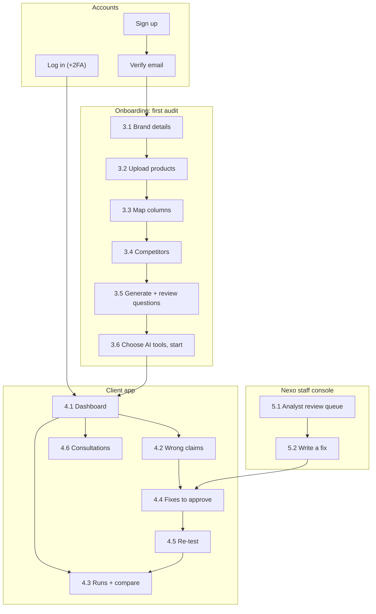

# Nexo platform: wireframes

> **Status:** planning draft (2026-09-30) for the **real product**. Low-fidelity: boxes show
> *what* is on each screen, not final design (styling comes from `src/styles/tokens.css`).
> System design: [ARCHITECTURE.md](ARCHITECTURE.md). The `/demo` page is a clickable mock of
> onboarding (3.x) and the dashboard (4.1) with simulated data.

## 1. Screen map


**Every signed-in screen:**
```
┌────────────────────────────────────────────────────────────────────────┐
│ [N nexo]  Brand [Niek ▾]  Dashboard  Runs  Products  Questions  Fixes  │
│                           Consultations                  🔔  [YA ▾]   │
├────────────────────────────────────────────────────────────────────────┤
│ Page title                                         [primary action]    │
│                           page content                                 │
└────────────────────────────────────────────────────────────────────────┘
 Phones: menu collapses to ☰, tables scroll sideways, cards stack.
```

## 2. Accounts
- **Sign up:** company, name, work email, password, plan → creates the organization; this user is **Owner**.
- **Verify email** (link valid 24 h) · **Log in** → **2FA code** if on (required for Nexo staff) ·
  5 failed tries = 15-min lockout · **Forgot password** (link valid 1 h) · **Accept invite**.

## 3. Onboarding (first audit)
Progress bar: `● Brand ─ ○ Products ─ ○ Columns ─ ○ Competitors ─ ○ Questions ─ ○ Run`

- **3.1 Brand details:** name, website, US location, industry (like the demo's Start step).
- **3.2 Upload products:** drag and drop or browse · CSV, TSV, Parquet, Excel, JSON · shows plan
  limits (e.g. Small: 25 MB, 100 products) · upload progress · [Download a template].

**3.3 Map columns + validation**
```
┌──────────────────────────────────────────────────────────────────┐
│ Your column      →  Nexo field                 Sample             │
│ Product Title    →  [name ▾] *required         Niek Stormline Trail│
│ Link             →  [product_url ▾]            https://…/stormline │
│ Blurb            →  [short_description ▾]      Trail runner with…  │
│ Who it's for     →  [target_customer ▾]        Trail runners who…  │
│ [x] Remember this mapping                                          │
│ ✓ 96 rows ready   ⚠ 3 duplicates merged   ✕ 1 skipped [Download]  │
│                                            [← Back]  [ Next → ]    │
└──────────────────────────────────────────────────────────────────┘
```

- **3.4 Competitors:** list with ✕ Remove, + Add, suggestions, aliases (plan limit 5 / 10 / 20).

**3.5 Generate + review questions**
```
┌──────────────────────────────────────────────────────────────────────┐
│ Types [x]Category [x]Feature [x]Comparison [x]Fact check [x]Budget … │
│ How many [ 40 ]            [ Generate ]   ◌ 23 of 40…                │
│ ──────────────────────────────────────────────────────────────────── │
│ 40 questions · version 1                [+ Add question] [Regenerate]│
│ ☑ What are the best trail running shoes?        Category    –    ✎ 🗑│
│ ☑ Best waterproof running shoes under $150?     Category  NK-101 ✎ 🗑│
│ ☑ Is the Niek Stormline Trail waterproof?       Fact check NK-101 ✎ 🗑│
│ ☐ (removed) Best socks for ultra runs?          Category  NK-108  ↺  │
│ This run: 39 questions × 1 tool = 39 of 200 this month               │
└──────────────────────────────────────────────────────────────────────┘
```
Edit ✎, remove 🗑 (restore ↺), add your own. Saving makes a new **version**; re-tests reuse it.

- **3.6 Choose AI tools + start:** ChatGPT checked (others "coming soon") · asked as a US
  shopper · cost vs allowance · [Start audit run] → email when the report is ready.

## 4. Client app

**4.1 Dashboard** (everything in the demo dashboard, plus run picker, sources, wrong claims, products, exports)
```
┌──────────────────────────────────────────────────────────────────────────┐
│ Brand report / Niek    Run [Sep 30 ▾]  [All tools|ChatGPT]  US  [PDF][CSV]│
├─────────────┬─────────────┬─────────────┬─────────────┬─────────────────┤
│ Visibility  │ Mentions    │ Avg position│ Sentiment   │ Wrong claims    │
│ ◔ 8%  3/39  │ 3 vs Altus22│ 4.6 vs 1.8  │ +18         │ ⚠ 1  [Review]   │
├─────────────┴─────────────┴─────────────┴─────────────┴─────────────────┤
│ Coverage over time (Niek + top 5 competitors, hover for values)          │
├────────────────────────────────────┬─────────────────────────────────────┤
│ Brand ranking (sentiment, mentions,│ Top sources the AI cited            │
│ coverage, share of voice)          │ runnersworld.example  14 answers    │
├────────────────────────────────────┴─────────────────────────────────────┤
│ Questions: ✓ Mentioned · ✕ Not mentioned · ! Wrong claim  (row → answer) │
│ Visibility index: Niek 8% coverage · 34% likely to buy · Low performance │
│ Products, worst visibility first                                         │
└──────────────────────────────────────────────────────────────────────────┘
```
Numbers load from the run's precomputed snapshot, so the page is fast.

**4.2 Wrong claims (the drill-down that sets Nexo apart)**
```
┌──────────────────────────────────────────────────────────────────────┐
│ ! ChatGPT: "The Niek Stormline Trail is not waterproof."             │
│ Verified data:  NK-101 · waterproof = (empty)                        │
│ Root cause:     short_description says "sealed weather membrane"    │
│                 but never "waterproof"                               │
│ Confirmed by analyst · affects 6 questions                            │
│ Suggested fix:  add "Waterproof" to title + description, set         │
│                 waterproof = yes                                     │
│ [View fix]  [Discuss in consultation]                                │
└──────────────────────────────────────────────────────────────────────┘
```

**4.3 Runs + compare:** list of runs (monthly, re-test, status and progress, quota used) →
**Compare** two runs: `Visibility 8% → 41% ▲ · Wrong claims 1 → 0 ▼ · questions now mentioning Niek ✕ → ✓`.

**4.4 Fixes to approve**
```
┌──────────────────────────────────────────────────────────────────┐
│ [To review 1] [Approved 2] [Done 3] [Rejected 0]                 │
│ HIGH  Add "Waterproof" to the Stormline Trail title + description │
│ Evidence: [AI answer]  Affects: 6 questions · NK-101              │
│ Before: Trail runner with a sealed weather membrane…              │
│ After:  Waterproof trail runner with a sealed weather membrane…   │
│ [ Approve ] [ Reject ] [ Comment ]                                │
│ Made the change?  [ Mark as done → re-test 6 questions ]          │
│ History: created Oct 2 · approved Oct 3 by the Owner              │
└──────────────────────────────────────────────────────────────────┘
```

- **4.5 Re-test:** only affected questions (default) or all · fresh answers (cache skipped) ·
  cost vs allowance → [Start re-test] → opens Compare.
- **4.6 Consultations:** like the demo's last step: data analyst + consultant, pick times, video
  or phone, notes → confirmation email; list of upcoming and past sessions.
- **Also:** **Products** (visibility per product, upload a new file) · **Questions library**
  (versions, edit) · **Settings** (team and roles, plan and usage bar with 80%/100% alerts, 2FA, sessions).

## 5. Nexo staff console
**5.1 Analyst review queue**
```
┌──────────────────────────────────────────────────────────────────┐
│ Niek · ChatGPT · "The Stormline Trail is not waterproof"          │
│ Product data: waterproof = (empty) · AI judge: likely wrong (0.86)│
│ [ Confirm wrong claim ]  [ Dismiss ]  [ Open full answer ]        │
└──────────────────────────────────────────────────────────────────┘
```
- **5.2 Write a fix:** problem, evidence, affected products/questions, before/after, priority → sent to the client (4.4).
- **Also:** **Clients** (plan, last run, quota, open claims and fixes) · **Availability** calendar
  and consultation requests · **Usage + budget** (AWS Budgets 50/80/100%, clients paused at
  quota → approve or keep paused, emergency "pause all runs").

## 6. Key flows
- **First audit:** sign up → verify → 3.1–3.6 → "report ready" email → dashboard → book a consultation.
- **Fix and prove it:** analyst confirms (5.1) → consultant writes fix (5.2) → client approves
  (4.4) → client edits their site → mark done → re-test (4.5) → before vs after (4.3).
- **Monthly:** scheduled run → quota check → answers (30-day cache) → scoring → analyst review
  → snapshot → email.
