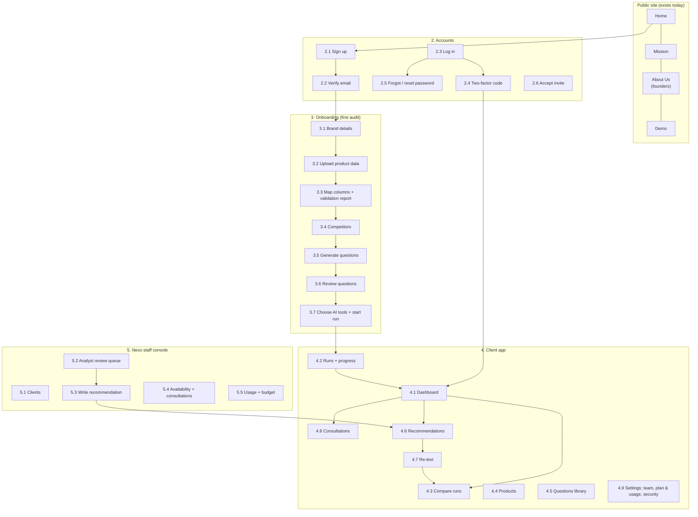

# Nexo platform: wireframes

> **Status:** planning draft (2026-09-30) for the **real product**. Low-fidelity: boxes show
> *what* is on each screen and *where*, not final design. Colors, fonts and components come from
> the existing design system (`src/styles/tokens.css`). How the system works behind these
> screens is in [ARCHITECTURE.md](ARCHITECTURE.md).
>
> The hackathon demo (`/demo`) is a clickable mock of screens 3.1 to 3.7 and 4.1 with fake data.

## 1. Screen map



**Global layout (every signed-in screen):**

```
┌──────────────────────────────────────────────────────────────────────────────┐
│ [N nexo]   Brand: [Niek ▾]      Dashboard  Runs  Products  Questions  Fixes  │
│                                  Consultations                 🔔  [YA ▾]   │
├──────────────────────────────────────────────────────────────────────────────┤
│ Page title                                              [primary action]     │
│ ─────────────────────────────────────────────────────────────────────────── │
│                                page content                                  │
└──────────────────────────────────────────────────────────────────────────────┘
 Phones: the menu collapses into ☰ ; tables scroll sideways; cards stack.
```

---

## 2. Accounts

### 2.1 Sign up
```
┌──────────────── Create your Nexo account ────────────────┐
│ Company name        [______________________]             │
│ Your name           [______________________]             │
│ Work email          [______________________]             │
│ Password            [______________________] (12+ chars) │
│ Plan                (•) Small  ( ) Mid  ( ) Large         │
│ [x] I agree to the Terms and Privacy Policy              │
│                               [ Create account ]         │
│ Already have an account? Log in                          │
└──────────────────────────────────────────────────────────┘
```
Creates the **organization** and makes this user its **Owner**. US companies only (location
is asked in 3.1).

### 2.2 Verify email
`"Check your inbox: we sent a link to name@company.com"` · [Resend email] · link expires in 24 h.

### 2.3 Log in · 2.4 Two-factor code
```
┌─────────── Log in ───────────┐     ┌──────── Enter your code ────────┐
│ Email     [______________]   │     │ Open your authenticator app.    │
│ Password  [______________]   │ ──► │ Code  [ _ _ _ _ _ _ ]           │
│ [ Log in ]  Forgot password? │     │ [ Verify ]  Use a backup code   │
└──────────────────────────────┘     └─────────────────────────────────┘
```
After 5 failed attempts: 15-minute lockout + email to the user. 2FA is required for Nexo staff.

### 2.5 Forgot / reset password
Email → one-time link (valid 1 h) → new password twice → all other sessions signed out.

### 2.6 Accept invite
`"Racielly invited you to join Niek as a Member"` → set name + password → dashboard.

---

## 3. Onboarding (first audit)

Progress bar on every onboarding screen:
```
 ● Brand ── ○ Products ── ○ Columns ── ○ Competitors ── ○ Questions ── ○ Review ── ○ Run
```

### 3.1 Brand details
```
┌──────────────────────────────────────────────────────────────┐
│ Brand name     [Niek__________]   Website [https://_______]  │
│ Location (US)  [Portland, OR__]   Industry [Running shoes ▾] │
│                                              [ Next → ]      │
└──────────────────────────────────────────────────────────────┘
```

### 3.2 Upload product data
```
┌──────────────────────────────────────────────────────────────┐
│ ┌ ─ ─ ─ ─ ─ ─ ─ ─ ─ ─ ─ ─ ─ ─ ─ ─ ─ ─ ─ ─ ─ ─ ─ ─ ─ ─ ─ ┐   │
│   Drag a file here, or [Browse]                               │
│   CSV · TSV · Parquet · Excel · JSON/JSONL                    │
│   Your plan: up to 25 MB and 100 products                     │
│ └ ─ ─ ─ ─ ─ ─ ─ ─ ─ ─ ─ ─ ─ ─ ─ ─ ─ ─ ─ ─ ─ ─ ─ ─ ─ ─ ─ ┘   │
│ ▓▓▓▓▓▓▓▓▓░░░ Uploading products.parquet  68%                   │
│ [Download a template]                    [← Back] [ Next → ]  │
└──────────────────────────────────────────────────────────────┘
```

### 3.3 Map columns + validation report
```
┌──────────────────────────────────────────────────────────────────────┐
│ Match your columns to Nexo fields                                    │
│  Your column          →  Nexo field              Sample value         │
│  Product Title        →  [name ▾]  *required     Niek Stormline Trail │
│  Link                 →  [product_url ▾]         https://…/stormline  │
│  Blurb                →  [short_description ▾]   Trail runner with…   │
│  Who it's for         →  [target_customer ▾]     Trail runners who…   │
│  Retail               →  [price ▾]               135                  │
│  Waterproof           →  [extra attribute ▾]     (empty)              │
│  [ ] Remember this mapping for next time                              │
│ ──────────────────────────────────────────────────────────────────── │
│ Validation:  ✓ 96 rows ready   ⚠ 3 duplicates merged   ✕ 1 row skipped │
│              [Download skipped rows]                                  │
│                                              [← Back] [ Next → ]      │
└──────────────────────────────────────────────────────────────────────┘
```
Required: `name` + (`product_url` or `short_description`). Everything else optional.

### 3.4 Competitors
Same as the demo: list of competitors (name + website + optional aliases), ✕ Remove,
+ Add, suggestions. Limit by plan (Small 5 / Mid 10 / Large 20).

### 3.5 Generate questions
```
┌──────────────────────────────────────────────────────────────┐
│ Nexo's open model will write shopper questions from your     │
│ 100 products, their target customers and 5 competitors.      │
│ Question types: [x] Category [x] Feature [x] Comparison       │
│                 [x] Fact check [x] Budget [x] Scenario [x] Brand│
│ How many:  [ 40 ] questions  (runs use 40 × tools of your    │
│            200 / month allowance)                             │
│                               [ Generate questions ]          │
│ ◌ Generating… 23 of 40 (you can leave this page)              │
└──────────────────────────────────────────────────────────────┘
```

### 3.6 Review questions
```
┌──────────────────────────────────────────────────────────────────────────┐
│ 40 questions · version 1                 [+ Add question] [Regenerate]   │
│ Filter: [All types ▾] [All products ▾]  Search [__________]              │
│ ┌──┬──────────────────────────────────────────┬──────────┬───────┬─────┐ │
│ │✓ │ Question                                 │ Type     │Product│     │ │
│ ├──┼──────────────────────────────────────────┼──────────┼───────┼─────┤ │
│ │☑ │ What are the best trail running shoes?   │ Category │  –    │ ✎ 🗑│ │
│ │☑ │ Best waterproof running shoes under $150?│ Category │NK-101 │ ✎ 🗑│ │
│ │☑ │ Is the Niek Stormline Trail waterproof?  │Fact check│NK-101 │ ✎ 🗑│ │
│ │☐ │ (removed) Best socks for ultra runs?     │ Category │NK-108 │ ↺   │ │
│ └──┴──────────────────────────────────────────┴──────────┴───────┴─────┘ │
│ Using 39 questions × 1 tool = 39 of your 200 this month                   │
│                                               [← Back] [ Next → ]         │
└──────────────────────────────────────────────────────────────────────────┘
```
✎ edits in place, 🗑 removes (can be restored ↺), **+ Add question** adds your own. Saving
creates a new question-set **version** (re-tests reuse the same version).

### 3.7 Choose AI tools + start run
```
┌──────────────────────────────────────────────────────────────┐
│ AI tools to test                                             │
│ [x] ChatGPT (OpenAI)   [ ] Gemini   [ ] Claude               │
│ [ ] Perplexity         [ ] Copilot    (coming soon)          │
│ Asked as: a shopper in the United States                     │
│ This run: 39 questions × 1 tool = 39 · Left this month: 161  │
│                                        [ Start audit run ]   │
└──────────────────────────────────────────────────────────────┘
```

---

## 4. Client app

### 4.1 Dashboard
```
┌────────────────────────────────────────────────────────────────────────────┐
│ Brand report / Niek / Overview                     [Export PDF] [Export CSV]│
│ Run: [Sep 30, 2026 ▾]  [Last 30 days]  [All tools | ChatGPT | …]  US       │
│ Report based on 39 questions × 1 tool · updated Sep 30, 2026                │
├──────────────┬──────────────┬──────────────┬──────────────┬───────────────┤
│ AI visibility│ Brand        │ Average      │ Sentiment    │ Wrong claims  │
│ ◔ 8%         │ mentions   3 │ position 4.6 │ +18          │ ⚠ 1 confirmed │
│ 3/39 answers │ vs Altus  22 │ vs Altus 1.8 │              │ [View]        │
├──────────────┴──────────────┴──────────────┴──────────────┴───────────────┤
│ Brand coverage over time            [Me + top 5 competitors ▾]            │
│  70 ┤  ╭─╮     ╭──╮                                                        │
│  35 ┤─╯  ╰─────╯  ╰──                                                      │
│   0 ┤━━━━━━━━━━━━━━━━━  Niek                                               │
│      ■ Niek ■ Altus ■ Kova ■ Ridgeline   (hover = values per day)          │
├───────────────────────────────────┬────────────────────────────────────────┤
│ Brand ranking                     │ Top sources AI cited                   │
│ # Brand  Sent. Mentions Cov. SoV  │ runnersworld.example   14 answers      │
│ 1 Altus  +64    22      56%  37%  │ reddit.example/r/trail 11 answers      │
│ …                                 │ niek.example            2 answers      │
│ 4 Niek   +18     3       8%   5%  │ [See all sources]                      │
├───────────────────────────────────┴────────────────────────────────────────┤
│ Questions                     [All ▾] [Not mentioned ▾]                    │
│ Best waterproof running shoes under $150?   Non-branded · 5 sources  ✕ Not │
│ Is the Niek Stormline Trail waterproof?     Position 1/1 · Branded  ! Wrong│
│ … (click a row → the full AI answer, mentions, claims, sources)            │
├────────────────────────────────────────────────────────────────────────────┤
│ Brand visibility index (coverage vs likelihood to buy) + table             │
│ Niche │ Leaders            Niek · 8% · 34% · Low performance               │
│ ──────┼────────                                                            │
│ Low   │ Low conversion                                                     │
│ perf. │                                                                    │
├────────────────────────────────────────────────────────────────────────────┤
│ Products: worst visibility first      [See all products]                   │
│ Wrong claims                          [See all]                            │
└────────────────────────────────────────────────────────────────────────────┘
```
Everything from the demo dashboard, plus: **run picker**, **top sources**, **wrong claims**,
**per-product** list, **exports**. Numbers come from the run's precomputed snapshot (fast).

### 4.2 Runs + progress
```
┌──────────────────────────────────────────────────────────────────────┐
│ Runs                                                  [ New run ]    │
│ Sep 30  Monthly     39 × 1   ✓ Complete        [Open] [Compare]      │
│ Oct 14  Re-test     6 × 1    ▓▓▓▓▓░░ Running 4/6  (2 cached, skipped │
│                                                     cache: re-test)  │
│ Nov 30  Monthly     scheduled                                        │
│ Quota: 45 of 200 used this month  ▓▓░░░░░░░░                         │
└──────────────────────────────────────────────────────────────────────┘
```
Status follows the run states in ARCHITECTURE.md (queued, running, scoring, analyst review,
complete, paused for quota, failed).

### 4.3 Compare runs (before vs after)
```
┌──────────────────────────────────────────────────────────────────────┐
│ Compare  [Sep 30 ▾]  vs  [Oct 14 re-test ▾]                          │
│ AI visibility     8% → 41%  ▲ 33 points                              │
│ Wrong claims       1 → 0    ▼ 1                                      │
│ Questions now mentioning Niek:                                       │
│  + Best waterproof running shoes under $150?   ✕ → ✓ (position 2)    │
│  + Is the Niek Stormline Trail waterproof?     ! → ✓ (correct now)   │
└──────────────────────────────────────────────────────────────────────┘
```

### 4.4 Products
Table of products (name, SKU, visibility %, wrong claims, last seen) → product detail with
its questions, answers and fixes. [Upload new file] reruns the ETL (3.2 → 3.3).

### 4.5 Questions library
The review table from 3.6 at any time: versions, edit/remove/add, "used in runs".

### 4.6 Recommendations (fixes)
```
┌──────────────────────────────────────────────────────────────────────┐
│ Fixes   [To review 1] [Approved 2] [Done 3] [Rejected 0]             │
├──────────────────────────────────────────────────────────────────────┤
│ HIGH  Add "Waterproof" to Stormline Trail title and description      │
│ Problem: ChatGPT says it "is not waterproof".                        │
│ Evidence: [View AI answer]   Affects: 6 questions · NK-101           │
│ ┌ Before ─────────────────────┐ ┌ After ─────────────────────────┐   │
│ │ Trail runner with a sealed  │ │ Waterproof trail runner with a │   │
│ │ weather membrane…           │ │ sealed weather membrane…       │   │
│ └─────────────────────────────┘ └────────────────────────────────┘   │
│ Suggested by: Consultant · Confirmed by: Analyst                     │
│ [ Approve ]  [ Reject ]  [ Comment ]                                 │
│ After you make the change: [ Mark as done → re-test 6 questions ]    │
│ History: Oct 2 created · Oct 3 approved by Racielly (Owner) · …      │
└──────────────────────────────────────────────────────────────────────┘
```
Nexo never edits client sites. Every action is saved in the audit log.

### 4.7 Re-test
```
┌──────────────────────────────────────────────────────────────┐
│ Re-test  (fresh answers, the 30-day cache is skipped)        │
│ (•) Only questions affected by done fixes   6 questions       │
│ ( ) All questions in version 1             39 questions      │
│ Tools: ChatGPT        Cost: 6 of 155 left this month          │
│                                          [ Start re-test ]    │
└──────────────────────────────────────────────────────────────┘
```

### 4.8 Consultations
Same as the demo's last step: data analyst + consultant, pick every time that works (from
Nexo staff availability), video or phone, notes → **Request consultation** → confirmation
email (SES). List of upcoming and past consultations with notes.

### 4.9 Settings
```
┌ Team ───────────────────────────────────┐ ┌ Plan & usage ────────────────────┐
│ Racielly  Owner   racielly@…   [···]    │ │ Plan: Small (invoiced monthly)   │
│ Lena      Member  lena@…       [···]    │ │ Questions: 45 / 200  ▓▓░░░░      │
│ [ Invite teammate ]  (3 users max)      │ │ Products: 100 / 100  (full)      │
└─────────────────────────────────────────┘ │ Alerts at 80% and 100%           │
┌ Security ───────────────────────────────┐ │ [Request more questions]         │
│ Two-factor: Off  [Turn on]              │ └──────────────────────────────────┘
│ Active sessions: 2  [Sign out others]   │
└─────────────────────────────────────────┘
```

---

## 5. Nexo staff console

### 5.1 Clients
Table: organization, plan, brands, last run, quota used, open wrong claims, open fixes,
next consultation. Filter by assigned analyst/consultant.

### 5.2 Analyst review queue
```
┌──────────────────────────────────────────────────────────────────────┐
│ Flagged claims (3)                                                   │
│ Niek · ChatGPT · "The Stormline Trail is not waterproof"             │
│ Product data says: waterproof = (empty); description: "sealed        │
│ weather membrane"   AI judge: likely wrong (0.86)                    │
│ [ Confirm wrong claim ]  [ Dismiss ]  [ Open full answer ]           │
└──────────────────────────────────────────────────────────────────────┘
```
Confirmed claims appear on the client dashboard; dismissed ones don't.

### 5.3 Write recommendation
Form: problem, evidence (link to the answer), affected products/questions, before/after text,
priority → **Send to client** (appears in 4.6 "To review" + email).

### 5.4 Availability + consultations
Weekly calendar where analysts and consultants mark open slots; list of requests to confirm.

### 5.5 Usage + budget
Company-wide API spend this month vs budget (AWS Budgets 50/80/100% alerts), per-client quota
use, clients paused at 100% → [Approve extra questions] / [Keep paused]. Emergency
**Pause all runs** switch.

---

## 6. Key user flows

**First audit (client):** Sign up → verify email → 3.1 → 3.2 upload → 3.3 map + fix → 3.4
competitors → 3.5 generate → 3.6 review/edit → 3.7 start → email "report ready" → 4.1 dashboard
→ 4.8 book consultation.

**Fix and prove it:** analyst confirms wrong claim (5.2) → consultant writes fix (5.3) → client
approves (4.6) → client changes their site → Mark as done → re-test affected questions (4.7)
→ before vs after (4.3).

**Monthly cycle:** scheduled run on plan date → quota check → answers (cache used, 30 days)
→ scoring → analyst review → snapshot → email → dashboard.
